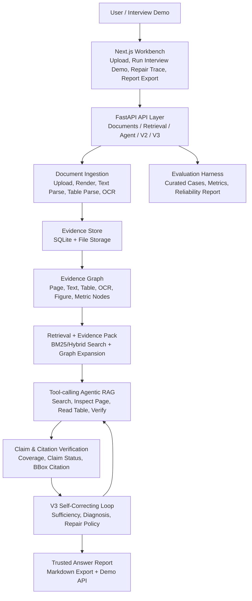
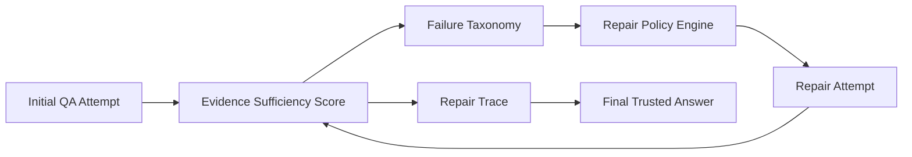

# MAGE-Doc 面试讲解文档：产品架构、功能点与技术点深讲

这份文档不是 README 摘要，而是给你面试前真正吃透项目用的讲解稿。

阅读方式：

- `你先理解`：面向你，解释这个模块为什么存在、解决什么问题、怎么实现。
- `面试话术`：面向面试官，可以直接说出来的话。
- `技术深挖`：面试官继续追问时，你可以展开的技术点。
- `对应实现`：仓库里的关键文件或模块，方便你回到代码里确认。

推荐你准备三种版本：

- 60 秒版本：讲清项目定位和最大亮点。
- 3 分钟版本：按产品主线讲完整闭环。
- 10-20 分钟版本：按架构层级讲技术细节、权衡和可追问点。

---

## 1. 项目一句话定位

### 1.1 你先理解

MAGE-Doc 是一个面向长 PDF 的多模态 Agentic RAG 系统。它不是简单把 PDF 切成文本块然后做 top-k 检索，而是把 PDF 中的页面、文本块、表格、OCR 文本、图表摘要、指标值等都结构化成证据节点，再构建 Evidence Graph，然后让 Agent 通过工具调用进行检索、读表、读页、验证、修复和导出报告。

这个项目重点解决的是普通 RAG 在长文档场景里的几个问题：

1. 长 PDF 不只是纯文本，还有页码、版面、表格、图片、图表、标题层级和跨页上下文。
2. 普通 top-k 检索容易只找到局部文本，漏掉附近表格、caption、指标、上下文段落。
3. 面试官最关心的不是“能不能调用大模型”，而是你是否能把一个 AI 应用做成可靠系统：有证据、有引用、有验证、有失败诊断、有修复闭环、有产品界面。
4. 简历项目要避免和常见“代码仓库 Agent / 聊天机器人 / 简单 RAG”同质化，所以这个项目主打长文档、多模态证据图、Agentic RAG、自修复和可信报告导出。

### 1.2 面试话术

> 我做的 MAGE-Doc 是一个面向长 PDF 的多模态 Agentic RAG 系统。它和普通 RAG 最大的区别是，我没有只把 PDF 当纯文本切块，而是把页面、文本块、表格、OCR、图表摘要、指标值都抽象成证据节点，再构建 Evidence Graph。Agent 回答问题时会通过工具检索、扩展证据、读表、验证引用，并在证据不足时做失败诊断和自修复，最后可以导出一份包含答案、引用、自修复过程和 tool trace 的可信 Markdown 报告。

### 1.3 技术深挖

你要主动强调三个关键词：

- `Long-PDF`：长文档场景，不是短文本 QA。
- `Multimodal Evidence Graph`：把文档结构化成可检索、可扩展、可引用的证据图。
- `Failure-aware Self-Correcting Agentic RAG`：不只是生成答案，还能判断证据是否充分、失败原因是什么、如何修复。

---

## 2. 总体架构图

### 2.1 架构图



### 2.2 你先理解

这张图要按“从用户操作到可信答案”的方向讲，而不是按代码目录堆模块。

最清晰的讲法是：

1. 用户在 Next.js Workbench 上传 PDF。
2. FastAPI 后端保存文档并渲染页面。
3. 后端解析文本块、表格、OCR 或视觉信息，并写入统一 evidence node。
4. 系统用 evidence node 构建 evidence graph。
5. 检索时先做关键词/混合检索，再沿图扩展上下文形成 evidence pack。
6. Agent 根据问题类型调用工具，比如搜索证据、读表、检查页面、验证答案。
7. Claim verifier 检查答案中的关键 claim 是否被引用支撑。
8. V3 自修复模块根据 sufficiency score 判断证据是否足够，如果不足就诊断失败原因并选择修复策略。
9. 最终前端展示答案、引用、修复过程，并导出可信报告。
10. 评测模块用本地 benchmark 验证策略效果。

### 2.3 面试话术

> 我介绍项目时一般按端到端主线讲：前端是一个 Next.js 文档 Workbench，后端是 FastAPI。用户上传 PDF 后，系统会渲染页面、解析文本和表格，把它们统一成 evidence nodes，并构建 Evidence Graph。回答问题时，系统不是直接把 top-k chunk 丢给模型，而是先检索候选证据，再通过图扩展拿到上下文，形成 evidence pack。Agent 会调用 search、inspect page、read table、verify answer 等工具生成带 citation 的答案。V3 里我又加了 sufficiency scoring、failure diagnosis 和 repair policy，所以证据不足时系统会自动尝试 query rewrite、node type expansion、graph depth expansion 等修复动作。最后可以导出一份 Markdown report，包含答案、引用、诊断、修复轮次和 tool trace。

---

## 3. 产品主线 Demo

### 3.1 主线流程

```text
Prepare PDF -> Evidence Graph -> Trusted QA -> Self-Correction -> Markdown Report
```

### 3.2 你先理解

这是你面试演示时最重要的主线。不要一上来讲“我实现了很多 phase”，那样面试官会觉得散。你要讲成一个产品闭环：

1. `Prepare PDF`：上传或选择 PDF，一键 prepare demo，后端完成渲染、文本解析、表格解析。
2. `Evidence Graph`：把页面、文本块、表格、OCR、图表、指标等都变成 evidence nodes，并建立关系。
3. `Trusted QA`：用户问问题，Agent 检索和读取证据，返回答案和 citation。
4. `Self-Correction`：系统判断证据是否充分，如果不充分，诊断失败原因并触发修复。
5. `Markdown Report`：导出一份可交付报告，里面有答案、引用、充分性评分、诊断、修复轮次和 trace。

这条主线的价值在于它不是“某个算法 demo”，而是一个完整 AI 产品原型。

现在前端还有一个真正的一键入口：`Run interview demo`。它会自动判断当前文档是否已经 `demo_ready`，如果没有就先调用 `prepare-demo`，然后调用后端 `trusted-demo` API，一次性完成 self-correcting QA 和 Markdown 报告生成，并在 Product Demo Panel 中展示答案摘要、最终充分性、修复轮次、引用数量、停止原因和报告预览。

### 3.3 面试话术

> 我后来专门把项目收束成一条产品级 Demo 主线：先 Prepare PDF，把长文档转成结构化证据；然后基于 Evidence Graph 做可信问答；如果答案证据不足，V3 的 self-correcting loop 会自动诊断并修复；最后可以导出 Markdown trusted answer report。前端现在有一个 `Run interview demo` 按钮，会自动串起 prepare、trusted QA、自修复和报告预览，所以面试时可以一键展示完整闭环。

### 3.4 技术深挖

这条主线对应的关键 API：

```text
POST /api/documents/{document_id}/prepare-demo
POST /api/v3/documents/{document_id}/self-correcting-questions
POST /api/v3/reports/trusted-answer
POST /api/v3/documents/{document_id}/trusted-demo
```

其中 `trusted-demo` 是组合型 API，把自修复问答和报告导出合成一条产品主线。面试时可以说：

> 为了让演示更产品化，我提供了一个组合型 trusted-demo API。它不是新算法，而是把 self-correcting QA 和 report export 编排成一个可自动化验收的产品流程。前端的一键演示按钮就是基于这个 API 做产品封装。

---

## 4. 前端 Workbench 层

### 4.1 你先理解

前端不是普通 landing page，而是一个面向操作的文档 Workbench。它要承担三个任务：

1. 让面试官看到项目不是后端接口堆积，而是能实际使用。
2. 把复杂 AI pipeline 可视化，降低理解成本。
3. 展示可信 RAG 的关键产物：PDF 页面、bbox 高亮、citation、trace、repair rounds、report export。

前端主要由这些组件组成：

- `UploadForm`：上传 PDF。
- `DocumentList`：展示文档、状态和 Prepare demo 操作。
- `DocumentWorkbench`：文档工作台总容器。
- `ProductDemoPanel`：展示产品主线、readiness、核心能力和一键面试 Demo。
- `PageViewer`：展示渲染后的 PDF 页面、文本/表格 bbox、选中 citation 高亮。
- `AskPanel`：基础 Agentic RAG 问答和引用展示。
- `RepairTracePanel`：V3 self-correction 问答、充分性评分、修复轮次、报告导出。
- `RetrievalPanel`：检索结果和 score breakdown 展示。

### 4.2 技术选型

前端使用 Next.js + React，原因：

1. Next.js App Router 适合做单页式工作台，同时可以用 server component 加载初始数据。
2. React client component 适合处理 citation selection、报告导出、表单状态等交互。
3. 对简历项目来说，Next.js 比纯 HTML 更能体现工程完整性，但又不会过度复杂。
4. 前端没有引入重型 UI 框架，主要使用局部 CSS，是为了保持可控、稳定、易讲解。

### 4.3 Product Demo Panel 的作用

`ProductDemoPanel` 是产品化收口时新增的。它不是核心算法，但非常重要，因为它解决了面试官第一眼不知道项目价值的问题。

它展示：

- 当前文档是否 demo ready。
- 当前主线是 Prepare、Ask、Repair、Export。
- 页面数量、证据预览、自修复和报告导出能力。
- `Run interview demo` 一键按钮：未准备时自动 prepare，随后运行 trusted-demo，展示答案摘要和报告预览，并提供 Markdown 下载。

### 4.4 面试话术

> 前端我没有做成营销页，而是做成一个文档 Workbench，因为这个项目的使用场景更像文档分析工具。Workbench 里可以上传 PDF、准备 Demo、查看页面和 bbox、提问、点击 citation 高亮证据，还可以查看 V3 self-correction 的 repair trace。Product Demo Panel 里还有一个 `Run interview demo` 按钮，可以一键完成 prepare、trusted QA、自修复摘要、报告预览和 Markdown 下载，让项目从“功能模块集合”收束成一个真正能演示的产品主线。

### 4.5 技术深挖

你可以强调几个前端技术细节：

1. Citation 高亮不是简单显示页码，而是把后端返回的 bbox 映射到页面图像上。
2. `RepairTracePanel` 是 client component，因为它需要管理报告导出状态、Blob 下载和预览。
3. `useFormState` 用于表单提交状态，避免手写大量 loading/error 状态。
4. 报告导出通过浏览器 Blob 完成，不需要额外文件服务器。

对应实现：

```text
frontend/app/page.tsx
frontend/components/document-workbench.tsx
frontend/components/product-demo-panel.tsx
frontend/components/page-viewer.tsx
frontend/components/ask-panel.tsx
frontend/components/repair-trace-panel.tsx
frontend/lib/api.ts
frontend/types/api.ts
```

---

## 5. FastAPI API 层

### 5.1 你先理解

FastAPI API 层是前端和后端能力之间的边界。它负责把文档处理、检索、Agent、V2 多模态、V3 自修复这些服务封装成清晰的 HTTP 接口。

这层的价值不是“写接口”，而是让系统有清晰的产品能力边界：

- Documents API：上传、列表、渲染、解析、prepare demo。
- Retrieval API：证据搜索、页面读取、表格读取。
- Agent API：问答、citation、trace。
- V2 API：多模态平台能力，如 collection、metric graph、failure diagnosis。
- V3 API：failure taxonomy、sufficiency score、repair policy、self-correcting questions、report export。

### 5.2 技术选型

选择 FastAPI 的理由：

1. 类型友好，和 Pydantic schema 配合好。
2. 自动生成 OpenAPI，适合解释 API 化能力。
3. TestClient 做后端集成测试方便。
4. 对 AI 应用来说，FastAPI 足够轻量，不会把项目复杂度浪费在框架本身。

### 5.3 面试话术

> 后端我用 FastAPI 做 API 层，核心原因是它和 Pydantic 类型体系配合很好。这个项目有很多结构化返回，比如 citation、bbox、tool trace、sufficiency score、repair rounds，所以我用 schema 明确输入输出，避免前后端靠隐式 JSON 对齐。API 层按 documents、retrieval、agent、v2、v3 拆分，让每一类能力都有明确边界。

### 5.4 技术深挖

你可以展开说：

- Pydantic schema 保证响应结构稳定，前端能定义 TypeScript 类型。
- SQLAlchemy session 通过 dependency 注入。
- 测试里通过 override `get_db` 创建临时 SQLite，保证测试隔离。
- V3 报告导出 API 不落库，是纯函数式转换，方便复用和测试。

对应实现：

```text
backend/app/api/documents.py
backend/app/api/v3.py
backend/app/schemas/v3.py
backend/app/db/session.py
backend/app/tests/test_v3_reliability.py
```

---

## 6. 文档摄入与解析层

### 6.1 你先理解

文档摄入层负责把用户上传的 PDF 变成后续 RAG 能使用的结构化证据。普通 RAG 很多时候只做文本切块，但 MAGE-Doc 做了更细的处理：

1. 保存原始 PDF。
2. 渲染每一页为图片。
3. 保存页面尺寸、图片尺寸、PDF 坐标。
4. 提取文本块并保存 bbox。
5. 提取表格并保存表格 bbox、矩阵、行列信息。
6. 在 V2 中扩展 OCR、图表视觉摘要、metric value。

### 6.2 为什么页面渲染重要

如果只做文本抽取，前端无法精确展示引用位置。MAGE-Doc 保存 page image 和 bbox，最终可以做到：

- citation 不只是“第几页”，而是页面上的具体区域。
- 前端点击 citation 后能高亮 PDF 区域。
- 面试官能直观看到答案来自哪里。

### 6.3 坐标系统原理

PDF 内部通常使用 point 坐标，例如页面宽高是 PDF point。渲染成 PNG 后，图片有 pixel 宽高。后端保存两套尺寸：

- PDF 页面尺寸：`width`, `height`
- 渲染图片尺寸：`image_width`, `image_height`

前端高亮时根据比例把 bbox 映射到图片上。

你可以这样理解：

```text
left_percent = bbox_x0 / pdf_width
top_percent = bbox_y0 / pdf_height
width_percent = (bbox_x1 - bbox_x0) / pdf_width
height_percent = (bbox_y1 - bbox_y0) / pdf_height
```

这样不管页面在浏览器里缩放到多大，bbox 都能按比例显示。

### 6.4 PyMuPDF 选型理由

项目使用 PyMuPDF 进行 PDF 渲染、文本块提取和基础表格识别。理由：

1. 本地可运行，不依赖外部服务。
2. 支持页面渲染，能生成前端可视化图片。
3. 能获取文本块坐标。
4. 能对规则表格做基础检测。
5. 适合简历项目中的可复现实验和自动化测试。

### 6.5 Prepare Demo API

`prepare-demo` 是产品主线里的关键接口。它把多个步骤编排成一个用户能理解的动作：

```text
render pages -> parse text blocks -> parse tables -> mark demo_ready
```

这样用户不用分别点 render、parse text、parse table，面试演示更顺。

### 6.6 面试话术

> 文档摄入这层我没有只做文本切块，而是先保存原始 PDF，再用 PyMuPDF 渲染页面并提取文本块和表格，同时保存 bbox 和页面尺寸。这样后续答案可以绑定到具体页面区域。Prepare demo API 本质上是一个 pipeline 编排，把 render、parse text、parse table 串起来，让前端能一键把 PDF 准备成可问答状态。

### 6.7 技术深挖

可能被问：

**为什么不用直接 OCR 全部页面？**

可以回答：

> 对 born-digital PDF，直接用 PDF parser 提取文本和表格更准确、更快，也保留原始坐标。OCR 更适合扫描版 PDF，所以我在 V2 把 OCR 做成补充 substrate，而不是所有文档都 OCR。

**表格解析可靠吗？**

可以回答：

> 当前基础版本用 PyMuPDF 的 table detection 处理规则表格，同时把表格 matrix 和 bbox 保存成 evidence node。复杂跨页表格不是 V0 的目标，后续通过 metric graph 和跨页合并增强。这个项目重点是展示从表格证据到 Agent 读表、引用和验证的闭环。

对应实现：

```text
backend/app/services/documents.py
backend/app/services/pages.py
backend/app/services/evidence.py
backend/app/services/pipeline.py
backend/app/tests/test_pipeline.py
backend/app/tests/test_pages.py
backend/app/tests/test_tables.py
```

---

## 7. Evidence Store 与 Evidence Graph

### 7.1 你先理解

Evidence Store 是系统保存结构化证据的地方。Evidence Graph 是在这些证据之间建立关系。

普通 RAG 的数据通常是：

```text
chunk_id -> chunk_text -> embedding
```

MAGE-Doc 的数据更像：

```text
document
  -> page
    -> text_block
    -> table
      -> table_cell
    -> figure
      -> caption
    -> metric_value
```

并且它们之间有边：

- `contains`：页面包含文本块或表格。
- `part_of`：单元格属于表格，块属于 section。
- `next`：阅读顺序相邻。
- `near`：版面空间上接近。
- `caption_of`：caption 描述图表。

### 7.2 为什么 Evidence Graph 有价值

长文档里的答案经常不在一个 chunk 内。例如：

- 问题在文本里提到指标，数值在表格里。
- 图表 caption 在图下面，解释在正文段落里。
- 一个 section 标题决定下方若干段落语义。
- 检索命中了表格，但需要附近标题知道这个表格属于哪个业务。

如果只拿 top-k chunk，很容易丢上下文。Evidence Graph 允许系统从命中的节点出发扩展邻居，拿到更完整证据。

### 7.3 面试话术

> 我设计 Evidence Graph 的核心原因是长 PDF 里的证据不是孤立文本块。比如表格和标题、图表和 caption、段落和 section 层级之间都有关系。普通 top-k 检索只返回几个 chunk，可能漏掉附近关键上下文。我把 page、text block、table、cell、figure、metric value 都建成节点，再用 contains、next、near、caption_of 等边连接。这样检索命中一个节点后，可以沿图扩展形成 evidence pack，提高答案证据完整性。

### 7.4 技术深挖

你可以展开：

- Graph 不是为了炫技，而是为了解决 retrieval context 缺失。
- 节点统一放在 `evidence_nodes`，通过 `node_type` 区分类型，避免每种证据都建独立模型造成系统割裂。
- 边放在 `evidence_edges`，支持关系类型和权重。
- 后续 OCR、figure、metric_value 都能进入同一套 evidence graph，因此扩展性好。

对应实现：

```text
backend/app/models/evidence.py
backend/app/models/graph.py
backend/app/services/graph.py
backend/app/schemas/graph.py
backend/app/tests/test_graph.py
docs/v1/phase01-evidence-graph-data-model-detailed-design.md
docs/v1/phase02-layout-section-graph-detailed-design.md
```

---

## 8. 检索层与 Evidence Pack

### 8.1 你先理解

检索层负责从证据库中找到与问题相关的候选证据。MAGE-Doc 不是只做一次 search，而是分两步：

1. `source retrieval`：先找候选节点。
2. `graph expansion`：沿 Evidence Graph 扩展上下文，形成 evidence pack。

Evidence Pack 可以理解为 Agent 的“证据包”，里面既有命中的节点，也有通过图关系补充的上下文。

### 8.2 为什么不是只用向量数据库

这个项目目前重点是本地可复现、结构化证据和 Agent workflow，所以没有把核心依赖放在外部向量数据库上。这样做有几个好处：

1. 测试稳定，不依赖外部服务。
2. 可以精确解释 score breakdown、matched terms 和证据来源。
3. 对表格、bbox、node_type 等结构化信息更可控。
4. 面试时更能展示你理解 RAG 可靠性的工程问题，而不只是接入一个向量库。

如果面试官问“是否可以接向量库”，你可以说：

> 可以，当前 retrieval 层是可替换的。现在为了本地可复现和清晰展示，我使用 BM25-style / hybrid scoring。后续可以把 candidate retrieval 换成 embedding vector search，但 evidence graph expansion、citation verification 和 self-correction 这些上层逻辑不需要变。

### 8.3 Evidence Pack 原理

Evidence Pack 的输入：

- document id
- query
- top_k
- depth
- node_types

输出：

- source candidates
- expanded nodes
- graph edges
- items
- summary
- tool trace

它解决的问题是：Agent 不应该只看到一个片段，而应该看到“这个片段和它相关上下文的组合”。

### 8.4 面试话术

> 检索层我做成了两阶段：先用关键词/混合检索找到 source candidates，再基于 Evidence Graph 做邻域扩展，生成 evidence pack。这个设计主要是为了解决长文档里 top-k chunk 上下文不足的问题。比如检索命中了表格，但答案还需要表格上方标题或者附近正文解释，graph expansion 就能把这些相关节点一起带给 Agent。

### 8.5 技术深挖

可展开点：

- `node_types` 可以限制检索范围，例如只查 table 或 text。
- score breakdown 可以解释检索结果，不是黑盒。
- Evidence Pack summary 能告诉你 source candidate count、expanded node count、edge count。
- V3 repair policy 可以通过增大 graph depth 或扩展 node_types 来修复 retrieval miss。

对应实现：

```text
backend/app/services/retrieval.py
backend/app/services/evidence_pack.py
backend/app/tests/test_retrieval.py
backend/app/tests/test_evidence_pack.py
docs/v1/phase03-hybrid-retrieval-index-detailed-design.md
docs/v1/phase04-graph-expansion-evidence-pack-detailed-design.md
```

---

## 9. Agentic RAG 基础流程

### 9.1 你先理解

MAGE-Doc 的 Agentic RAG 不是完全开放式 Agent，而是一个确定性、可测试、可解释的 tool-calling workflow。

基础流程：

```text
classify question
-> choose tool plan
-> search evidence
-> inspect page or read table
-> draft answer
-> attach citations
-> verify answer
-> verify claims
-> record trace
```

为什么不用完全自由 Agent？

因为简历项目和面试项目最怕不可复现。确定性 workflow 更容易测试、更容易展示 trace，也更容易解释每一步为什么发生。

### 9.2 问题分类

系统会根据关键词和数字判断问题类型：

- `table_lookup`：收入、利润、margin、年份、指标等。
- `text_lookup`：普通文本事实查询。

不同问题类型对应不同工具路径：

- table lookup：优先搜索表格，读表，取相关 row。
- text lookup：搜索文本，inspect page，提取相关 snippet。

### 9.3 Tool Trace

每次 Agent 调用工具都会产生 trace：

- tool_name
- input
- output_summary
- latency_ms

Trace 的价值：

1. 面试官能看到 Agent 不是黑盒。
2. 出错时可以知道错在检索、读表、验证还是 claim。
3. V3 自修复可以复用 trace 和 signals 做诊断。

### 9.4 Citation

Citation 返回：

- node_id
- node_type
- page_number
- bbox
- snippet

这让前端可以高亮具体证据区域。

### 9.5 面试话术

> Agentic RAG 这部分我没有做成完全自由的 LangChain Agent，而是做成确定性的 tool-calling workflow。原因是文档智能产品更需要可解释和可测试。系统先判断问题是 table lookup 还是 text lookup，然后选择 search evidence、read table、inspect page、verify answer 等工具。每一步都会记录 tool trace，最终答案会带 node id、page number、bbox 和 snippet，所以前端可以点击 citation 高亮证据。

### 9.6 技术深挖

可能被问：

**为什么叫 Agentic RAG？**

可以回答：

> 因为它不是一次性检索后生成，而是有问题分类、工具选择、证据读取、验证和 trace 的多步骤工作流。虽然当前实现是确定性的，但它保留了 Agent 的核心：使用工具完成任务，并根据中间结果组织后续步骤。

**如果接入 LLM 会怎么做？**

可以回答：

> LLM 可以替换 draft answer 和 query rewrite 部分，但底层 evidence graph、retrieval、citation、claim verification、repair policy 都可以保留。也就是说，我把 LLM 放在可替换的位置，而不是让系统可靠性完全依赖 prompt。

对应实现：

```text
backend/app/services/agent.py
backend/app/services/tool_registry.py
backend/app/services/trace_store.py
backend/app/tests/test_agent.py
backend/app/tests/test_trace_store.py
docs/v0/phase06-agentic-rag-loop-detailed-design.md
docs/v1/phase05-tool-registry-trace-store-detailed-design.md
```

---

## 10. Claim Verification 与可信答案

### 10.1 你先理解

普通 RAG 的问题之一是：答案看起来很合理，但不知道每个关键结论是否被证据支撑。

Claim Verification 做的是把答案拆成若干 claim，然后逐个判断：

- supported
- partial
- unsupported
- insufficient evidence

这不是为了追求复杂 NLP，而是为了在产品层面表达“这个答案是否可信”。

### 10.2 为什么 Claim Verification 很加分

面试官会觉得你不是只会“调模型”，而是考虑了 AI 产品的可靠性：

1. 防 hallucination。
2. 帮用户知道哪些结论有依据。
3. 给 V3 self-correction 提供信号。
4. 可以进入报告导出，形成交付物。

### 10.3 面试话术

> 我在 V1 加了 claim-level verification。系统生成答案后，不只是返回文本，而是检查答案里的关键 claim 是否被 citation 支撑，并给出 supported、partial、unsupported 或 insufficient evidence。这个结果一方面展示给用户，另一方面也作为 V3 self-correction 的输入信号。如果 claim 不被支持，系统就不应该盲目相信答案，而应该触发诊断和修复。

### 10.4 技术深挖

你可以强调：

- 当前 verifier 是本地规则和证据匹配，目的是可测试。
- `claim_supported` 信号进入 sufficiency score。
- 报告导出里会包含 claim verification summary 和 claim 明细。
- 未来可以替换为 LLM-based NLI verifier，但接口和数据结构不需要大改。

对应实现：

```text
backend/app/services/claim_verification.py
backend/app/schemas/claim_verification.py
backend/app/tests/test_claim_verification.py
docs/v1/phase06-claim-verification-detailed-design.md
```

---

## 11. V2 多模态 Agent 平台能力

V2 的意义是把项目从“长 PDF 文本/表格 RAG”升级成“多模态 Agent 平台”。

### 11.1 OCR Substrate

#### 你先理解

扫描版 PDF 没有可提取文本，普通 parser 会拿不到 text block。OCR substrate 解决这个问题：

- 检测扫描页。
- 对页面图片做 OCR。
- 把 OCR 结果写成 `ocr_text_block` evidence node。
- 让 OCR 文本进入同一套检索和 evidence graph。

#### 面试话术

> V2 里我加了 OCR substrate，用来处理扫描版 PDF。它不是单独做一条 OCR 流程，而是把 OCR 结果统一写成 `ocr_text_block` evidence node，所以后续检索、graph expansion、citation 和 verification 都能复用原有架构。

### 11.2 Vision Grounding

#### 你先理解

PDF 里很多问题来自图表，而图表内容不一定在文本中出现。Vision grounding 的目标是把 figure/chart 也变成 evidence：

- 识别 figure/chart 区域。
- 生成 visual summary。
- 保存为 `figure`、`chart`、`visual_summary` 节点。
- 与 caption、附近正文建立关系。

#### 面试话术

> 对图表类问题，我没有只依赖 caption，而是把 figure/chart 和 visual summary 也纳入 evidence graph。这样图表相关信息可以和 caption、正文、指标节点关联，后续 Agent 可以检索和引用这些视觉证据。

### 11.3 Metric Graph

#### 你先理解

很多商业文档的问题是指标型的，例如“2026 年收入是多少”“利润率变化多少”。Metric graph 把指标、年份、数值、实体抽出来：

```text
metric_value: revenue / 2026 / 128
```

它的作用是让数字问题更结构化，而不是只靠文本相似度。

#### 面试话术

> 我在 V2 加了 metric graph，把表格或文本里的指标值结构化成 metric_value 节点，比如指标名、年份和值。这样数字类问题可以从结构化证据中回答，也能和原始表格 citation 关联。

### 11.4 Multi-document Collection

#### 你先理解

真实产品通常不是只问一份 PDF，而是问一个文档集合。Collection 能力支持：

- 多文档组织。
- 跨文档检索。
- 保留 document metadata。
- 后续支持对比类问题。

#### 面试话术

> V2 里我把单文档能力扩展到 collection 层，支持多文档组织和跨文档检索。这主要是为了贴近真实产品场景，比如同时分析多份年报、研究报告或政策文件。

### 11.5 MCP Tool Server

#### 你先理解

MCP 的价值是把 MAGE-Doc 的工具暴露给外部 Agent。也就是说，MAGE-Doc 不只是一个 Web 应用，还可以作为 Agent 工具服务器。

暴露的工具包括：

- search_doc
- inspect_page
- read_table
- build_evidence_pack
- verify_claims

#### 面试话术

> 我还做了 MCP-compatible tool server，把文档搜索、页面检查、读表、证据包构建、claim verification 这些能力封装成外部 Agent 可调用的工具。这样项目不只是一个 UI Demo，也可以成为 Agent 平台中的文档工具层。

### 11.6 Benchmark Adapter 与 Failure Diagnosis

#### 你先理解

Benchmark adapter 的作用是把系统输出适配成评测格式。Failure diagnosis 的作用是分析失败类型，为 V3 自修复做铺垫。

Failure 类型可以包括：

- retrieval miss
- graph miss
- citation mismatch
- unsupported claim
- OCR confidence gap
- visual grounding gap

#### 面试话术

> V2 后半部分我做了 benchmark adapter 和 failure diagnosis。前者用于把系统输出适配成评测报告，后者用于把失败样例归因成 retrieval miss、graph miss、citation mismatch、unsupported claim 等类型。这个设计为 V3 的 self-correction 做了基础，因为系统要先知道为什么失败，才能决定怎么修复。

对应实现：

```text
backend/app/services/v2_ocr.py
backend/app/services/v2_vision.py
backend/app/services/v2_metric.py
backend/app/services/v2_collections.py
backend/app/services/v2_mcp.py
backend/app/services/v2_failure_diagnosis.py
backend/app/tests/test_v2_multimodal.py
backend/app/tests/test_v2_platform.py
docs/v2/
```

---

## 12. V3 Self-Correcting Agentic RAG

这是项目最前沿、最适合深讲的部分。

### 12.1 你先理解：为什么要做 V3

普通 RAG 的失败通常不是一个原因：

- 检索没找到正确证据。
- 找到了文本但漏掉表格。
- 引用了证据但 answer claim 不被支持。
- 图表或 OCR 信息没进入检索。
- evidence pack 上下文不足。

如果系统只是“再检索一次”，很盲目。V3 的思想是：

```text
先判断证据是否充分
再诊断失败原因
再选择对应修复动作
最后记录 repair trace
```

这就是 failure-aware self-correcting Agentic RAG。

### 12.2 V3 子模块总览



### 12.3 Evidence Sufficiency Score

#### 你先理解

Sufficiency score 用来判断当前证据是否足够支撑答案。它不是只看有没有 citation，而是综合多个信号：

- `answer_term_hit`：答案是否覆盖问题中的关键术语。
- `citation_node_type_hit`：citation 类型是否符合问题需求，例如表格问题是否引用 table 或 metric_value。
- `claim_supported`：claim verification 是否支持。
- `evidence_pack_context_hit`：evidence pack 是否包含扩展上下文。

输出：

- score
- label：sufficient / partial / insufficient
- missing_signals
- recommended_policy

#### 面试话术

> V3 的第一步是 evidence sufficiency scoring。它不只是检查有没有引用，而是综合答案术语命中、citation 类型是否匹配、claim 是否被支持、evidence pack 上下文是否充分等信号，输出 sufficient、partial 或 insufficient。这个分数决定系统是直接返回答案，还是进入失败诊断和修复。

### 12.4 Failure Taxonomy

#### 你先理解

Failure taxonomy 用来回答“为什么当前结果不可靠”。它输出：

- reason
- severity
- confidence
- signals
- repair_candidates

典型失败原因：

- `retrieval_miss`：检索没有找到正确证据。
- `graph_context_gap`：找到了点，但缺少上下文。
- `citation_type_mismatch`：引用类型不对，例如表格问题引用了文本。
- `unsupported_claim`：答案 claim 没有被 citation 支撑。
- `visual_grounding_gap`：图表证据不足。

#### 面试话术

> Failure taxonomy 的作用是把 RAG 失败结构化。系统不会只说“答案错了”，而是判断错在哪里，比如 retrieval miss、citation type mismatch、unsupported claim 或 graph context gap。每个 diagnosis 都带 severity、confidence 和 repair candidates，后续 repair policy 会根据这个 diagnosis 选择动作。

### 12.5 Repair Policy Engine

#### 你先理解

Repair policy 把 failure diagnosis 映射成可执行修复动作。

常见动作：

- `query_rewrite`：改写查询，加入 table、metric、revenue 等提示词。
- `node_type_expansion`：从只检索 text_block 扩展到 table、metric_value、ocr_text_block 等。
- `graph_depth_expansion`：扩大 graph expansion depth。
- `citation_rerank`：优先选择更符合问题类型的 citation。
- `conservative_answer_rewrite`：证据不足时保守回答。
- `vision_grounding_retry`：图表证据不足时重试视觉 grounding。

#### 面试话术

> Repair policy engine 的作用是把失败原因映射成动作。比如如果诊断是 retrieval miss，优先 query rewrite；如果是 citation type mismatch，就做 node type expansion 或 required type filter；如果是 graph context gap，就加大 graph depth。这样修复不是盲目 retry，而是有策略的。

### 12.6 Self-Correcting Loop

#### 你先理解

V3 的自修复流程可以理解成：

```text
run initial attempt
score sufficiency
if sufficient:
    return answer
else:
    diagnose failure
    build repair plan
    run repaired attempt
    keep result if score improves
    repeat until sufficient or max rounds
return final answer + repair trace
```

关键点：

1. 初始尝试可能故意使用较窄 node_types，模拟真实检索 miss。
2. 每一轮 repair 都记录 before_sufficiency 和 after_sufficiency。
3. 如果修复后分数更高，就保留修复结果。
4. stop_reason 解释停止原因，比如 `sufficient_after_repair` 或 `max_repair_rounds_reached`。

### 12.7 Repair Trace

Repair trace 是面试展示重点。它展示：

- 初始 sufficiency。
- 最终 sufficiency。
- final diagnosis。
- 每轮 repair action。
- before/after score。
- stop reason。

这让面试官看到系统是如何“发现不可靠 -> 修复 -> 得到更可靠答案”的。

### 12.8 面试话术

> V3 是我最想强调的部分。我做的是 failure-aware self-correcting Agentic RAG。系统先跑一次 QA，然后用 sufficiency score 判断证据是否充分。如果不足，就用 failure taxonomy 诊断失败原因，再用 repair policy engine 选择修复动作，比如 query rewrite、node type expansion 或 graph depth expansion。每一轮都会记录 before/after sufficiency 和 selected action，前端可以看到完整 repair trace。这个设计让 RAG 不只是生成答案，而是有自我检查和局部修复能力。

### 12.9 技术深挖

可能被问：

**这个 self-correction 和普通 retry 有什么区别？**

回答：

> 普通 retry 通常只是换个 prompt 或重新检索一次，缺少明确失败归因。我这里先做 sufficiency scoring 和 failure diagnosis，再根据 diagnosis 选择动作。例如 citation type mismatch 就扩展 node type，graph context gap 就扩大 graph depth，retrieval miss 就 query rewrite。所以它是 failure-aware repair，不是随机 retry。

**为什么不用大模型判断 sufficiency？**

回答：

> 当前实现用结构化信号是为了可测试、可复现。比如 citation 类型命中、claim support、context hit 这些都可以稳定评测。未来可以把 LLM judge 加进去，但我会把它作为一个额外 signal，而不是完全替代结构化判断。

**如何防止无限修复？**

回答：

> 有 max_repair_rounds，上限被限制。同时每轮会比较 before/after sufficiency，只有变好才保留结果。如果无法达到 sufficient，就返回最终结果和 stop_reason，而不是无限循环。

对应实现：

```text
backend/app/services/v3_sufficiency.py
backend/app/services/v3_failure_taxonomy.py
backend/app/services/v3_repair_policy.py
backend/app/services/v3_self_correcting_agent.py
backend/app/api/v3.py
frontend/components/repair-trace-panel.tsx
backend/app/tests/test_v3_reliability.py
docs/v3/
```

---

## 13. Trusted Answer Report 导出

### 13.1 你先理解

报告导出是产品化收口功能。它的价值是把一次问答从“页面上的结果”变成“可交付产物”。

报告包含：

- question
- answer
- trace id
- stop reason
- initial/final sufficiency
- final diagnosis
- citations table
- repair rounds table
- claim verification
- tool trace

### 13.2 为什么选择 Markdown

Markdown 的理由：

1. 简单、稳定、可 diff。
2. 适合 GitHub 和面试展示。
3. 不引入 PDF 排版复杂度。
4. 可以后续转换成 PDF、HTML 或 DOCX。

### 13.3 Report Export API

```text
POST /api/v3/reports/trusted-answer
```

输入是 self-correcting response，输出：

- filename
- markdown
- summary

组合型 API：

```text
POST /api/v3/documents/{document_id}/trusted-demo
```

它会先运行 self-correcting QA，再生成报告。

### 13.4 面试话术

> 我最后加了 trusted answer report export，把一次问答结果导出成 Markdown。报告里不仅有答案，还有 citations、sufficiency score、failure diagnosis、repair rounds、claim verification 和 tool trace。这个功能的价值是让 RAG 输出从“聊天回复”变成“可审计交付物”。我选择 Markdown 是因为它简单、可 diff、适合 GitHub 展示，后续也可以转换成 PDF。

### 13.5 技术深挖

你可以说：

- 报告生成服务是纯函数，不依赖数据库，输入 response 输出 markdown。
- Markdown 中的表格对 `|` 和换行做了转义，避免破坏表格。
- 文件名使用 title slug + timestamp，避免冲突。
- 前端用 Blob 触发浏览器下载，不需要后端写文件。

对应实现：

```text
backend/app/services/v3_report_export.py
backend/app/api/v3.py
frontend/components/repair-trace-panel.tsx
docs/product-demo/product-demo-polish-design.md
```

---

## 14. 评测体系与质量闭环

### 14.1 你先理解

一个简历级 AI 项目不能只说“我测过”，要有评测闭环。MAGE-Doc 有几层验证：

1. 后端自动化测试：文档上传、页面渲染、表格解析、检索、Agent、claim verification、V2、V3。
2. 前端 production build：验证类型和构建。
3. Eval harness：输出 V1/V2/V3 报告。
4. Curated cases：专门覆盖 failure-aware self-correction。

### 14.2 为什么用生成 PDF 测试

测试中用 PyMuPDF 生成小 PDF，有几个好处：

1. 不依赖外部样本文件。
2. 测试可复现。
3. 可以精确控制文本、表格、页面布局。
4. 可以验证端到端流程：上传 -> prepare -> ask -> repair -> report。

### 14.3 面试话术

> 我为了避免项目只停留在 Demo，给后端做了比较完整的自动化测试。测试里会动态生成 PDF，包括文本和表格，然后走上传、prepare demo、检索、问答、self-correction 和 report export。这样测试不依赖外部文件，也能验证真实链路。当前后端全量测试是 46 个用例，前端 production build 也通过。

### 14.4 技术深挖

可以强调：

- `TestClient` + 临时 SQLite 做隔离。
- `monkeypatch` 临时替换 upload/page image root。
- V3 测试覆盖了 report export 和 trusted-demo API。
- Eval reports 用来支撑简历中“做过评测和可靠性分析”的说法。

对应实现：

```text
backend/app/tests/
eval/run_eval.py
eval/reports/v1_eval_report.md
eval/reports/v2_benchmark_report.md
eval/reports/v3_reliability_report.md
```

---

## 15. 端到端示例：Revenue 问题如何流转

### 15.1 用户问题

```text
What was revenue in 2026?
```

### 15.2 系统步骤

#### Step 1：问题分类

系统看到 `revenue` 和 `2026`，判断这是 `table_lookup`。

面试话术：

> 系统首先会根据关键词和数字判断这是一个表格/指标类问题，所以后续会优先关注 table 或 metric_value 证据。

#### Step 2：初始检索

初始尝试可能先查 text_block，模拟真实系统中常见的 retrieval miss。

面试话术：

> 初始检索可能只命中文本证据，但表格问题真正需要 table evidence。这种情况下 sufficiency score 会发现 citation node type 不匹配。

#### Step 3：Draft Answer

Agent 从当前 evidence pack 中选择候选证据生成答案。

面试话术：

> Agent 会基于当前 evidence pack 生成一个初始答案，并带上 citation。这里答案不是裸文本，而是绑定到具体 node id、page 和 bbox。

#### Step 4：Verify Answer 和 Claim

系统检查 citation 是否覆盖，claim 是否被支持。

面试话术：

> 生成后系统会做 citation verification 和 claim verification。如果 claim 没有被证据支撑，这个结果不会被认为是完全可信。

#### Step 5：Sufficiency Score

如果发现表格问题没有引用 table，score 可能是 partial 或 insufficient。

面试话术：

> Sufficiency score 会综合答案术语、citation 类型、claim support 和上下文命中。如果表格问题没有表格 citation，就会被判断为证据不足。

#### Step 6：Failure Diagnosis

系统诊断为 retrieval miss 或 citation type mismatch。

面试话术：

> 接着 failure taxonomy 会把问题归因，比如这是 retrieval miss 或 citation type mismatch，而不是简单说答案错了。

#### Step 7：Repair Policy

选择 query rewrite 或 node type expansion。

面试话术：

> Repair policy 会根据诊断选择动作。比如 query rewrite 会把查询改写得更偏 table metric revenue evidence；node type expansion 会允许检索 table 和 metric_value。

#### Step 8：Repair Attempt

系统重新构建 evidence pack，找到表格，生成更好的答案。

面试话术：

> 修复后 Agent 会重新检索和生成。如果 after_sufficiency 比 before 更高，就保留修复结果。

#### Step 9：前端展示 Repair Trace

前端显示初始 score、最终 score、repair round、selected action。

面试话术：

> 前端的 repair trace 能展示每一轮修复前后分数和具体动作，所以面试官可以看到系统不是黑盒。

#### Step 10：导出报告

用户点击 Export .md，得到可信报告。

面试话术：

> 最后用户可以导出 Markdown 报告，里面包含答案、引用、自修复过程、claim verification 和 tool trace。这让一次 RAG 问答变成可审计的交付物。

---

## 16. 技术选型总表

| 层级 | 技术选型 | 为什么选 | 面试重点 |
| --- | --- | --- | --- |
| 前端 | Next.js + React | 快速构建产品 Workbench，支持 server/client component | 不是 landing page，而是可操作产品界面 |
| 后端 | FastAPI | 类型清晰、OpenAPI、测试友好 | AI 能力 API 化 |
| Schema | Pydantic + TypeScript types | 前后端结构化响应 | citation、trace、repair rounds 稳定 |
| 数据库 | SQLite + SQLAlchemy | 本地可复现，适合简历 Demo | 可以替换为 Postgres |
| PDF | PyMuPDF | 渲染、文本、bbox、表格基础解析 | 支持 citation 高亮 |
| 检索 | BM25-style / hybrid local retrieval | 可解释、可测试、无需外部依赖 | 可替换为向量库 |
| 证据组织 | Evidence Graph | 长文档上下文扩展 | 区别于普通 chunk RAG |
| Agent | Deterministic tool workflow | 可解释、可测试、trace 清晰 | 可替换 LLM 部分 |
| 验证 | Claim verification + citation verification | 降低 hallucination | 可信答案 |
| 自修复 | Sufficiency + diagnosis + repair policy | failure-aware 修复 | 前沿亮点 |
| 报告 | Markdown export | 可交付、可 diff、轻量 | 产品化闭环 |
| 评测 | pytest + eval harness | 质量闭环 | 简历可信度 |
| 平台扩展 | MCP server | 外部 Agent 可调用 | Agent 平台化 |

---

## 17. 和普通 RAG 的区别

| 维度 | 普通 RAG | MAGE-Doc |
| --- | --- | --- |
| 文档处理 | 文本切块 | 页面、文本、表格、OCR、图表、指标结构化 |
| 上下文 | top-k chunks | Evidence Pack + Graph Expansion |
| 引用 | 文本片段或页码 | node id + page + bbox + snippet |
| 表格能力 | 容易丢表格结构 | table node + read_table + metric graph |
| 可解释性 | 通常只有答案 | tool trace + citation + claim verification |
| 失败处理 | 重新生成或人工调 prompt | sufficiency score + failure taxonomy + repair policy |
| 产品交付 | 聊天回复 | Workbench + repair trace + Markdown report |
| 评测 | 常缺失 | 自动化测试 + eval reports |

### 面试话术

> 我觉得这个项目和普通 RAG 最大区别是它围绕“可信长文档问答”设计了完整系统。普通 RAG 主要是 chunk、embedding、top-k、generate；MAGE-Doc 先做多模态 evidence graph，再做 evidence pack，再让 Agent 通过工具读证据、验证 claim，并在证据不足时自修复。最后还把结果导出成可信报告，所以它更像一个文档智能产品，而不是聊天 demo。

---

## 18. 60 秒版本讲法

你可以背这个：

> MAGE-Doc 是我做的一个面向长 PDF 的多模态 Agentic RAG 系统。它和普通 RAG 不同的是，我没有只做文本切块和 top-k 检索，而是把 PDF 的页面、文本块、表格、OCR、图表摘要和指标值都建成 evidence nodes，再构建 Evidence Graph。用户问问题时，Agent 会检索证据、沿图扩展 evidence pack、读表或检查页面、生成带 bbox citation 的答案，并做 claim verification。V3 里我加了 failure-aware self-correction：系统会先判断证据是否充分，如果不足，就诊断是 retrieval miss、citation mismatch 还是 unsupported claim，再选择 query rewrite、node type expansion、graph depth expansion 等修复策略。最后前端 Workbench 可以展示 repair trace，并导出包含答案、引用、修复过程和 tool trace 的 Markdown 报告。

---

## 19. 3 分钟版本讲法

### 19.1 开场

> 这个项目叫 MAGE-Doc，定位是长 PDF 场景下的多模态 Agentic RAG。目标不是做普通文档聊天，而是解决年报、研究报告、技术手册这类长文档中的可信问答问题。

### 19.2 架构

> 架构上前端是 Next.js Workbench，后端是 FastAPI。PDF 上传后，系统会渲染页面、解析文本块和表格，并保存 bbox。V2 中还扩展了 OCR、图表 grounding 和 metric graph。所有证据都会进入统一的 evidence node 表，再构建 page、text、table、caption、metric 等节点之间的 Evidence Graph。

### 19.3 问答流程

> 问答时系统先做检索，再基于 Evidence Graph 扩展上下文形成 evidence pack。Agent 根据问题类型调用工具，比如 search evidence、inspect page、read table、verify answer。答案返回时会带 citation，包括 node id、页码、bbox 和 snippet，所以前端可以高亮证据区域。

### 19.4 可靠性

> 为了提高可靠性，我加了 claim verification 和 V3 self-correction。系统会给当前答案计算 evidence sufficiency score，如果证据不足，就用 failure taxonomy 诊断失败原因，再用 repair policy 选择 query rewrite、node type expansion 或 graph depth expansion 等动作。每轮修复都会记录 before/after score 和 selected action。

### 19.5 产品闭环

> 最后我把项目收束成产品级 demo：Prepare PDF -> Evidence Graph -> Trusted QA -> Self-Correction -> Markdown Report。前端提供 `Run interview demo` 一键入口，可以自动跑完整主线并展示报告预览；也可以进入 Repair Trace 面板深挖每轮修复。后端有 46 个测试用例，前端 production build 也通过。

---

## 20. 10 分钟深讲顺序

面试官愿意听细节时，按这个顺序讲：

1. 项目定位：为什么是长 PDF，多模态，可信 RAG。
2. 文档摄入：PDF 渲染、文本/表格解析、bbox。
3. Evidence Graph：为什么不用纯 chunk，节点和边怎么设计。
4. Retrieval + Evidence Pack：候选检索 + 图扩展。
5. Agentic RAG：问题分类、工具调用、trace、citation。
6. Claim Verification：答案可信度。
7. V2 多模态：OCR、vision、metric graph、collection、MCP。
8. V3 自修复：sufficiency、taxonomy、repair policy、repair trace。
9. Product Demo：Workbench、一键面试 Demo、报告导出、trusted-demo API。
10. 测试与评测：pytest、eval reports、生成 PDF 测试。

---

## 21. 高频追问与回答

### 21.1 为什么做 Evidence Graph，而不是只做向量检索？

面试话术：

> 因为长 PDF 中很多答案依赖版面和结构关系，比如表格和标题、图表和 caption、段落和 section。纯向量检索只能返回相似 chunk，不一定拿到结构上下文。Evidence Graph 可以在检索命中后沿 contains、near、caption_of、next 等边扩展上下文，形成 evidence pack。向量检索可以作为 candidate retrieval，但 graph expansion 解决的是上下文组织问题。

### 21.2 为什么当前没有强依赖外部 LLM？

面试话术：

> 这是一个工程项目，我优先保证端到端可复现和可测试。当前很多模块用 deterministic workflow 实现，是为了把数据结构、证据链、trace、verification 和 repair loop 打牢。真正接入 LLM 时，我会把 LLM 放在 query rewrite、answer drafting 或 claim judging 这些可替换位置，而不是让整个系统可靠性只靠 prompt。

### 21.3 如果要上生产，怎么扩展？

面试话术：

> 数据层可以从 SQLite 换成 Postgres，文件存储换成对象存储，检索层接入向量数据库或 Elasticsearch，异步任务用 Celery/RQ，OCR 和视觉模型可以拆成 worker 服务。当前项目的接口和数据模型是按这些边界拆的，所以升级基础设施不需要重写 Agent 和 self-correction 逻辑。

### 21.4 如何评价 self-correction 是否真的有效？

面试话术：

> 我用 curated cases 和 reliability report 来评估。每个 case 标注 expected failure mode 和 repair expectation。指标包括 recovery rate、repair success rate、repair rounds、failure distribution before/after。测试中也验证 repair 后 final sufficiency 不低于 initial sufficiency，并且能输出 repair trace。

### 21.5 如何处理幻觉？

面试话术：

> 我从三个层面处理：第一，答案必须带 citation，citation 包含 node id、page、bbox；第二，claim verification 检查答案中的 claim 是否被证据支持；第三，V3 sufficiency score 会把 claim support 和 citation type 纳入判断，如果不充分就触发 failure diagnosis 和 repair。证据仍不足时，系统会返回 stop_reason，而不是假装答案可靠。

### 21.6 表格问题怎么回答？

面试话术：

> 系统会先把问题分类为 table_lookup，然后优先检索 table 或 metric_value。读表工具会读取表格 matrix，选择与问题相关的 row，并把答案绑定到表格 evidence node。V3 里如果一开始引用了文本而不是表格，sufficiency score 会发现 citation type mismatch，repair policy 会触发 node type expansion 或 query rewrite。

### 21.7 图表问题怎么处理？

面试话术：

> V2 里我把 figure/chart 和 visual_summary 纳入 evidence graph，并和 caption、附近正文建立关系。这样图表问题可以检索视觉摘要，也可以通过 graph expansion 拿到 caption 和正文解释。当前实现偏本地 demo，真实生产可以接入更强的 VLM 生成 chart summary。

### 21.8 为什么要导出 Markdown 报告？

面试话术：

> 因为文档智能产品最终不应该只停留在聊天界面，而要能交付可审计结果。Markdown 报告轻量、可 diff、适合 GitHub 展示，里面包含答案、引用、sufficiency、diagnosis、repair rounds、claim verification 和 tool trace。后续如果需要，可以再渲染成 PDF 或 Word。

### 21.9 这个项目最有技术含量的部分是什么？

面试话术：

> 我认为最有含量的是把长文档 RAG 做成了证据图和自修复闭环。Evidence Graph 解决的是长文档多模态上下文组织问题；V3 self-correction 解决的是 RAG 失败后如何诊断和局部修复的问题。相比普通 RAG，这两个点更能体现系统设计和可靠性思考。

### 21.10 当前项目有什么不足？

面试话术：

> 当前项目为了本地可复现，很多模型能力做成 deterministic 或轻量 mock，比如 answer drafting、vision summary、claim judging。真正生产化时，我会接入 embedding model、reranker、VLM 和 LLM judge，同时把任务队列、缓存、权限、多租户和观测系统补齐。但现在的价值是底层证据结构、Agent workflow、verification 和 repair loop 已经完整，外部模型可以作为可替换模块接入。

---

## 22. 简历项目亮点表达

可以写成：

> MAGE-Doc：基于多模态证据图的长文档 Agentic RAG 系统。实现 PDF 上传、页面渲染、文本/表格/OCR/图表/指标 evidence node 抽取，构建 page-section-block-table-figure-metric evidence graph；实现 hybrid retrieval、graph-expanded evidence pack、tool-calling QA Agent、bbox citation 高亮、claim verification、trace store；设计 failure-aware self-correcting RAG，支持 sufficiency scoring、failure taxonomy、repair policy、repair trace 和可信 Markdown 报告导出；构建 benchmark/eval harness 和 Next.js 产品 Workbench，后端全量测试 46 passed。

---

## 23. 你必须真正理解的 8 个核心点

如果时间有限，至少把这 8 点吃透：

1. 为什么普通 chunk RAG 不适合长 PDF。
2. Evidence Node 和 Evidence Graph 分别是什么。
3. bbox citation 为什么比页码 citation 更可信。
4. Evidence Pack 为什么需要 graph expansion。
5. Agentic RAG 的工具调用流程是什么。
6. Claim Verification 如何降低 hallucination。
7. V3 self-correction 为什么不是普通 retry。
8. Markdown report export 为什么体现产品闭环。

---

## 24. 最终收束话术

面试最后可以这样总结：

> 总体来说，这个项目我想展示的不是“我会接一个 RAG API”，而是我能把一个 AI 应用从数据摄入、证据建模、检索、Agent 工具调用、引用验证、失败修复、评测和产品交付完整做出来。MAGE-Doc 的核心价值是多模态 Evidence Graph 和 failure-aware self-correcting Agentic RAG。它既有前沿性，也有工程闭环，所以适合作为简历里的主项目来讲。
