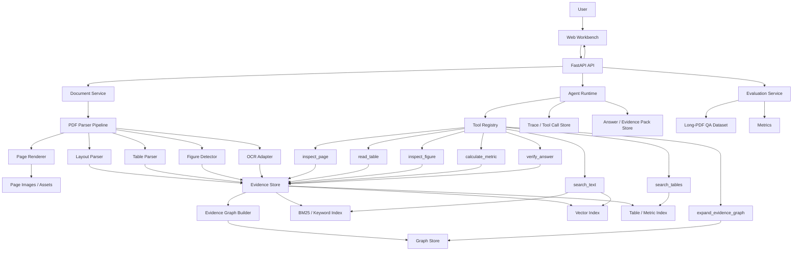

# MAGE-Doc 概要设计

## 1. 总体架构

MAGE-Doc 采用“解析层 + 证据图层 + 检索工具层 + Agent 编排层 + 评测层 + 工作台”的架构。



## 2. 推荐技术栈

| 层 | 推荐选型 | 说明 |
| --- | --- | --- |
| Frontend | Next.js, React, TypeScript, Tailwind CSS | 构建 PDF 工作台、证据高亮、trace 面板 |
| Backend | Python 3.11+, FastAPI, SQLAlchemy | API、任务编排、数据模型 |
| PDF render | PyMuPDF / Poppler | 页面渲染、bbox 坐标、截图 |
| PDF text/layout | PyMuPDF + pdfplumber | P0 稳定可控 |
| Table extraction | Camelot / pdfplumber / Tabula adapter | P0 可先用 pdfplumber，保留 adapter |
| OCR | PaddleOCR / Tesseract adapter | P1 开启扫描版 PDF |
| Vision | GPT-4.1/4o-class vision or local VLM adapter | P1 用于图表描述 |
| Agent orchestration | LangGraph-style workflow | 多阶段、可追踪、可重试 |
| Vector store | Qdrant / LanceDB | 文本块、caption、表格摘要向量检索 |
| Sparse retrieval | BM25 | 指标、年份、实体、表头精确召回 |
| Graph | NetworkX for P0, Neo4j optional P2 | 证据图邻域扩展 |
| Metadata DB | SQLite for P0, PostgreSQL optional P2 | 文档、节点、任务、trace |
| Evaluation | JSONL dataset + pytest/CLI runner | 可复现评测 |
| Deployment | Docker Compose | 本地演示 |

P0 选择应避免重型依赖堆叠。核心是把“证据图 + Agent 工具 + 引用高亮 + 评测”做扎实。

## 3. 数据模型

### 3.1 Document

| 字段 | 类型 | 说明 |
| --- | --- | --- |
| `id` | string | 文档 ID |
| `filename` | string | 原始文件名 |
| `title` | string | 文档标题 |
| `page_count` | int | 页数 |
| `status` | enum | uploaded / parsing / indexed / failed |
| `parser_version` | string | 解析器版本 |
| `created_at` | datetime | 创建时间 |

### 3.2 Page

| 字段 | 类型 | 说明 |
| --- | --- | --- |
| `id` | string | 页面 ID |
| `document_id` | string | 文档 ID |
| `page_number` | int | 1-based 页码 |
| `width` | float | 页面宽度 |
| `height` | float | 页面高度 |
| `image_path` | string | 页面渲染图片 |
| `text_density` | float | 文本密度 |

### 3.3 EvidenceNode

| 字段 | 类型 | 说明 |
| --- | --- | --- |
| `id` | string | 证据节点 ID |
| `document_id` | string | 文档 ID |
| `page_id` | string | 页面 ID |
| `node_type` | enum | section/text_block/table/table_cell/figure/caption/footnote/metric |
| `text` | string | 文本内容或结构化摘要 |
| `bbox` | json | `[x0, y0, x1, y1]` |
| `section_path` | list | 章节路径 |
| `metadata` | json | 行列、表头、caption、解析置信度等 |
| `embedding_id` | string | 向量索引 ID |

### 3.4 EvidenceEdge

| 字段 | 类型 | 说明 |
| --- | --- | --- |
| `source_id` | string | 起点节点 |
| `target_id` | string | 终点节点 |
| `edge_type` | enum | contains/next_block/nearby/caption_of/mentions/supports/derived_from |
| `weight` | float | 边权重 |
| `metadata` | json | 解析来源和置信度 |

### 3.5 AgentTrace

| 字段 | 类型 | 说明 |
| --- | --- | --- |
| `id` | string | trace ID |
| `question_id` | string | 问题 ID |
| `step_name` | string | Agent 节点名 |
| `input_summary` | string | 输入摘要 |
| `output_summary` | string | 输出摘要 |
| `tool_calls` | list | 工具调用 ID |
| `latency_ms` | int | 耗时 |
| `token_count` | int | token |
| `status` | enum | success / failed / retried |

### 3.6 EvidencePack

| 字段 | 类型 | 说明 |
| --- | --- | --- |
| `answer_id` | string | 答案 ID |
| `claim_id` | string | claim ID |
| `evidence_node_ids` | list | 支撑证据 |
| `citation_text` | string | 引用文本 |
| `page_numbers` | list | 页码 |
| `bbox_list` | list | 高亮区域 |
| `support_status` | enum | supported / partial / unsupported |

## 4. PDF 解析链路

### 4.1 P0 解析流程

1. 接收 PDF，计算文件 hash。
2. 使用 PyMuPDF 渲染页面图片。
3. 使用 PyMuPDF/pdfplumber 提取文本块和坐标。
4. 根据字体大小、粗细、编号模式和位置推断标题层级。
5. 过滤页眉页脚候选，但保留可回溯记录。
6. 使用 pdfplumber 提取表格候选。
7. 根据 caption 关键词和附近文本识别表格/图片说明。
8. 保存 blocks、tables、figures、pages。
9. 构建 evidence graph。
10. 建立 BM25、向量索引和表格索引。

### 4.2 版面块规范化

每个 block 都需要标准化：

- 坐标统一到页面像素或 PDF point 坐标。
- 文本保留原始值和清洗值。
- 保存 reading order。
- 保存 parser confidence。
- 保存和相邻 block 的距离。

### 4.3 表格解析策略

P0 支持单页表格：

- 表格 bbox。
- 行列结构。
- 单元格文本。
- 表头候选。
- 表格 caption。
- 表格摘要 embedding。

表格摘要示例：

```text
Table on page 42: revenue by segment for 2022, 2023, 2024. Columns: segment, 2022, 2023, 2024, YoY. Important metrics: cloud revenue, software revenue, gross margin.
```

这样可以让表格进入语义检索，同时仍保留结构化单元格用于计算。

### 4.4 图表解析策略

P0 不强依赖复杂图表 OCR。先完成：

- 图表区域检测。
- caption 提取。
- 附近正文关联。
- 图表缩略图展示。
- 可选人工/模型生成 figure description。

P1 再加入视觉模型：

- 图表类型识别。
- 坐标轴和 legend 解析。
- 图中数值抽取。
- 图表问答。

## 5. Evidence Graph 构建

### 5.1 节点构建

每个页面生成：

- page node。
- section nodes。
- text block nodes。
- table nodes。
- table row/cell nodes。
- figure nodes。
- caption nodes。

### 5.2 边构建

基本边：

- document -> page: `contains`
- page -> block: `contains`
- section -> block: `contains`
- block -> next block: `next_block`
- block -> nearby block: `nearby`
- caption -> table/figure: `caption_of`

语义边：

- text block -> metric: `mentions`
- table cell -> metric: `mentions`
- calculated metric -> table cell: `derived_from`
- answer claim -> evidence node: `supports`

### 5.3 图扩展策略

检索得到初始证据后，Agent 可以扩展：

- 同页邻近 block。
- 同章节前后段落。
- caption 关联的表格或图。
- 表格中的同一行/列。
- 同一指标在不同年份或章节的出现。

这使系统区别于普通 top-k RAG。

## 6. Agent 工作流设计

### 6.1 状态对象

Agent state 应包含：

```json
{
  "question": "...",
  "document_id": "...",
  "question_type": "table_reasoning",
  "plan": [],
  "constraints": {
    "max_tool_calls": 12,
    "max_context_tokens": 12000,
    "require_citations": true
  },
  "candidate_evidence": [],
  "selected_evidence": [],
  "claims": [],
  "answer": "",
  "verification": []
}
```

### 6.2 问题分类

分类标签：

- `fact_lookup`
- `section_summary`
- `table_lookup`
- `metric_calculation`
- `figure_grounding`
- `cross_page_reasoning`
- `risk_analysis`
- `compare_and_contrast`
- `insufficient_information`

分类结果决定工具预算和检索策略。

### 6.3 工具路由策略

| 问题类型 | 首选工具 | 后续工具 |
| --- | --- | --- |
| fact_lookup | `search_text` | `inspect_page`, `expand_evidence_graph` |
| section_summary | `search_text` | `expand_evidence_graph` |
| table_lookup | `search_tables` | `read_table`, `inspect_page` |
| metric_calculation | `search_tables` | `read_table`, `calculate_metric`, `verify_answer` |
| figure_grounding | `search_text` | `inspect_figure`, `inspect_page` |
| cross_page_reasoning | `search_text`, `search_tables` | `expand_evidence_graph`, `verify_answer` |
| risk_analysis | `search_text` | `expand_evidence_graph`, `verify_answer` |

### 6.4 Verifier 规则

Verifier 必须检查：

- 每个核心 claim 是否至少有一个 evidence node。
- 引用是否来自同一个文档。
- 页码和 bbox 是否存在。
- 表格数字是否和单元格文本一致。
- 计算公式是否可复现。
- 图表问题是否引用了 figure/caption 或附近正文。
- 如果证据不足，答案应显示“不足以判断”，而不是编造。

### 6.5 失败修复

P1 引入局部修复：

- `missing_evidence`：改写 query，扩大章节或图邻域。
- `wrong_table`：使用表头和指标实体重新搜索表格。
- `numeric_mismatch`：重新读取单元格并调用 `calculate_metric`。
- `unsupported_claim`：删除 claim 或触发二次检索。
- `over_budget`：压缩证据，只保留 claim-relevant nodes。

## 7. API 设计

### 7.1 Document APIs

| Method | Path | 说明 |
| --- | --- | --- |
| `POST` | `/api/documents` | 上传 PDF |
| `GET` | `/api/documents` | 文档列表 |
| `GET` | `/api/documents/{id}` | 文档详情 |
| `POST` | `/api/documents/{id}/parse` | 启动解析 |
| `GET` | `/api/documents/{id}/status` | 解析状态 |
| `GET` | `/api/documents/{id}/pages/{page_number}` | 页面结构和图片 |

### 7.2 Ask APIs

| Method | Path | 说明 |
| --- | --- | --- |
| `POST` | `/api/documents/{id}/questions` | 发起 Agentic RAG 问答 |
| `GET` | `/api/questions/{question_id}` | 获取答案 |
| `GET` | `/api/questions/{question_id}/trace` | 获取 Agent trace |
| `GET` | `/api/questions/{question_id}/evidence` | 获取 evidence pack |

### 7.3 Graph and Evaluation APIs

| Method | Path | 说明 |
| --- | --- | --- |
| `GET` | `/api/documents/{id}/evidence-graph` | 获取证据图摘要 |
| `POST` | `/api/evaluations` | 运行评测 |
| `GET` | `/api/evaluations/{run_id}` | 评测详情 |
| `GET` | `/api/evaluations/{run_id}/metrics` | 指标 |

## 8. 前端设计

### 8.1 页面结构

推荐单页工作台：

- 左侧：文档列表、解析状态、页码导航。
- 中间：PDF 页面查看器，支持 bbox 高亮。
- 右侧：Ask 面板、答案、引用、证据列表。
- 底部或抽屉：Agent trace、tool calls、evidence graph、evaluation。

### 8.2 关键交互

- 上传后显示解析进度。
- 问答时实时追加 trace。
- 点击引用跳转 PDF 页并高亮 bbox。
- 点击 table evidence 打开表格结构视图。
- 点击 figure evidence 打开图表截图和 caption。
- Evidence graph 支持从 claim 展开到支撑节点。

### 8.3 视觉表达

界面应偏专业工具风格：

- 重点突出 PDF、证据和 trace。
- 避免营销式大 hero。
- 用紧凑布局承载长文档任务。
- 使用清晰状态色表达 supported / partial / unsupported。

## 9. 评测设计

### 9.1 数据格式

`evals/datasets/long_pdf_qa.jsonl`：

```json
{
  "id": "annual_report_001",
  "document_id": "doc_apple_2024_10k",
  "question": "What caused the decline in gross margin in 2024?",
  "question_type": "cross_page_reasoning",
  "answer_points": [
    "Higher product costs",
    "Different product mix"
  ],
  "evidence": [
    {
      "page": 38,
      "bbox": [72, 180, 510, 260],
      "node_type": "text_block"
    },
    {
      "page": 45,
      "table_id": "table_45_1",
      "cells": ["Gross margin 2023", "Gross margin 2024"]
    }
  ],
  "requires_calculation": false,
  "requires_cross_page": true
}
```

### 9.2 Strategy Runner

每个策略实现统一接口：

```python
class RagStrategy:
    name: str

    def answer(self, document_id: str, question: str) -> StrategyResult:
        ...
```

策略：

- `text_only_vector`
- `text_hybrid`
- `layout_aware_hybrid`
- `table_aware_agentic`
- `evidence_graph_agent`

### 9.3 指标计算

指标分为四类：

- Retrieval：`evidence_recall_at_k`, `mrr`, `node_type_coverage`
- Grounding：`citation_precision`, `citation_coverage`, `faithfulness_score`
- Reasoning：`answer_accuracy`, `table_qa_accuracy`, `calculation_accuracy`
- Efficiency：`latency_p50`, `latency_p95`, `tool_call_count`, `token_cost`

## 10. P0 开发阶段

### Phase 1：项目骨架与文档解析

- FastAPI + Next.js 项目骨架。
- PDF 上传。
- 页面渲染。
- 文本块和基础表格解析。
- 文档状态 UI。

### Phase 2：Evidence Graph 与索引

- Evidence node/edge 数据模型。
- Graph builder。
- BM25 + vector + table index。
- 页面 bbox 高亮能力。

### Phase 3：Agentic RAG 闭环

- Tool registry。
- search_text/search_tables/inspect_page/read_table/expand_graph。
- Planner/Router/Evidence Collector/Answer Composer/Verifier。
- 答案引用和证据包。

### Phase 4：工作台可视化

- PDF viewer。
- Ask panel。
- Agent trace panel。
- Evidence graph panel。
- Table viewer。

### Phase 5：评测闭环

- 3 份 PDF。
- 60 条 QA 数据。
- 5 种策略对比。
- 指标面板。
- README、截图、demo runbook。

## 11. 目录规划

```text
mage-doc/
  README.md
  docs/
    requirements.md
    outline-design.md
    development-plan.md
    demo-runbook.md
  backend/
    app/
      api/
      core/
      db/
      models/
      schemas/
      services/
        parsing/
        evidence_graph/
        indexing/
        tools/
        agent/
        evaluation/
  frontend/
    app/
    components/
    lib/
    types/
  evals/
    datasets/
    sample_pdfs/
  docker-compose.yml
  .env.example
```

## 12. 简历加分点检查

完成后应能支撑以下面试展开：

- 为什么长 PDF RAG 不能只做向量检索。
- 如何保留 PDF layout 和 bbox 证据。
- 如何让表格进入检索，同时保留结构化计算能力。
- evidence graph 如何帮助跨页推理。
- Agent 为什么需要工具路由，而不是固定 pipeline。
- Verifier 如何减少幻觉。
- 评测集如何构造，指标如何证明改进。
- 如何控制工具调用成本和延迟。
- 如何从 P0 升级到多文档、多模态、MCP Server。

